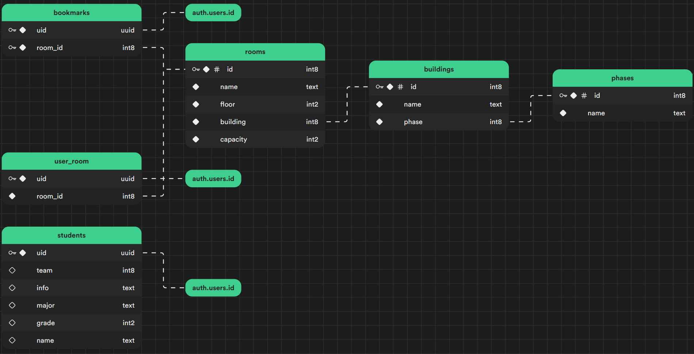

# Dormitory Management System

This is demo Dormitory Management System web app. Check out the deployment here: <https://master--rococo-sunburst-fe7928.netlify.app/>

## Tech-stacks used

- [Svelte](https://svelte.dev/) + [SvelteKit](https://kit.svelte.dev/)
- [Supabase](https://supabase.com/) for database and authentication
- [Skeleton](https://www.skeleton.dev/) UI library
- [TailwindCSS](https://tailwindcss.com/)

## Developing

Clone the project and try locally:

```bash
git clone https://github.com/namasSinjali/assignment-dorm-management.git
cd assignment-dorm-management
npm install
```

Development server:

```bash
npm run dev

# or start the server and open the app in a new browser tab
npm run dev -- --open
```

To create a production version of your app:

```bash
npm run build
```

You can preview the production build with `npm run preview`.

> To deploy your app, you may need to install an [adapter](https://kit.svelte.dev/docs/adapters) for your target environment.

### Setting Up Supabase

Create new Supabase project and create tables with following schema:



> Make sure to populate with some data

### Environment Variables

Lastly, Set up environment variables to store supabase project api keys and url.

Create`.env.local` file.

```
PUBLIC_SUPABASE_URL=<your supabase project url>
PUBLIC_SUPABASE_ANON_KEY=<your supabase anon key>
SERVICE_ROLE_KEY=<your supabase service role key>
```

> The keys can be found in project settings.
>
> **Note: Make sure to keep the SERVICE_ROLE_KEY secret**
